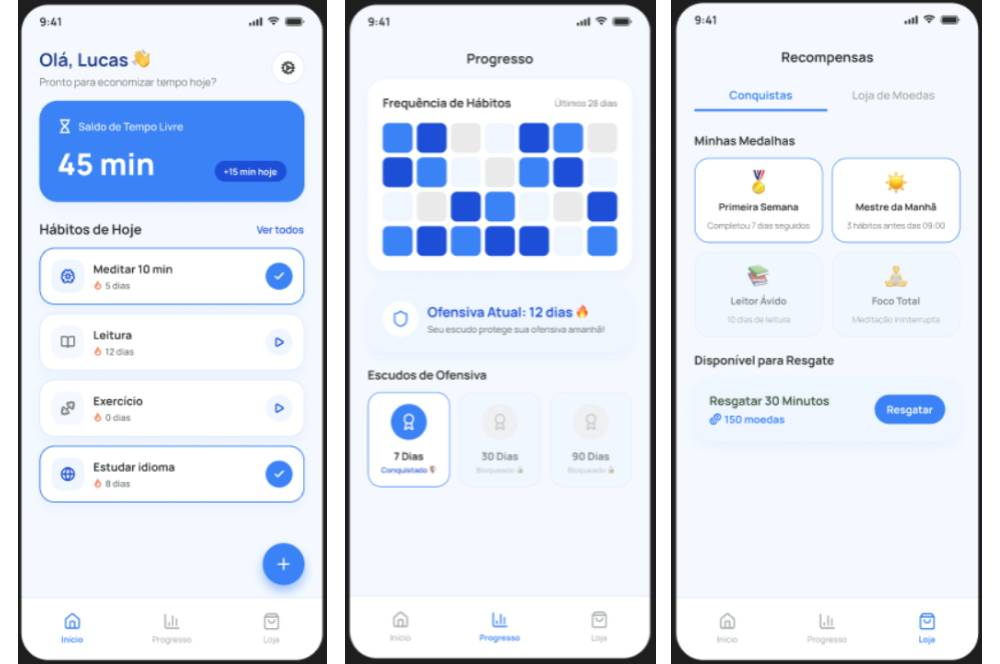
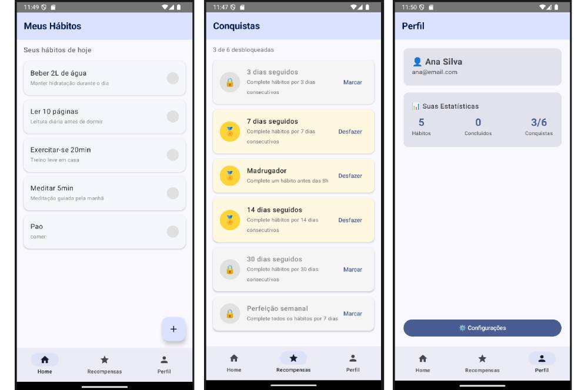

# Processo de Desenvolvimento - Trabalho 2

## Integrante
- Marcio Henrique

## Tema Escolhido
**HabitTracker** - Aplicativo individual de rastreamento de hábitos diários com gamificação (conquistas).

## Decisões Técnicas

### 1. Arquitetura de Navegação
Optei por usar **Navigation Compose** com `NavHost` centralizado no `AppNavigation.kt`, seguindo o padrão demonstrado na Aula 13 do professor. A `BottomNavigationBar` foi implementada com 3 abas principais (Home, Recompensas, Perfil), e telas secundárias (Novo Hábito, Detalhes, Configurações) são acessadas via navegação forward com botão de voltar (`popBackStack`).

**Por quê?** Centralizar as rotas no objeto `Rotas.kt` evita erros de digitação e facilita a manutenção. A BottomBar com `currentBackStackEntryAsState` garante que o item ativo seja destacado corretamente.

### 2. Gerenciamento de Estado
Usei um **ViewModel compartilhado** (`HabitViewModel`) com `mutableStateListOf` para manter as listas de hábitos e conquistas em memória. O ViewModel é criado no `AppNavigation` e passado como parâmetro para todas as telas.

**Por quê?** Dados precisam sobreviver à navegação entre telas (ex: adicionar hábito na tela "Novo Hábito" e ver na Home). `mutableStateListOf` garante recomposição automática do Compose quando a lista muda. Não usei banco de dados pois o escopo é apenas memória RAM.

### 3. Estrutura de Pacotes
Organizei o código em:
- `data/model/` → Data classes (`Habito`, `Conquista`)
- `ui/screens/` → Telas Compose
- `ui/viewmodel/` → HabitViewModel
- `navigation/` → Rotas e AppNavigation

**Por quê?** Separação clara de responsabilidades. Facilita encontrar arquivos e seguir o princípio de responsabilidade única.

### 4. Complexidade Extra (Tela de Detalhes do Hábito)
Na `DetalheHabitoScreen`, implementei:
- Cálculo da **taxa de conclusão global** (hábitos concluídos / total)
- **Barra de progresso visual** (`LinearProgressIndicator`)
- Formatação dos dias da semana em texto legível
- Estatísticas combinadas de todos os hábitos

**Por quê?** Atende ao requisito: "pelo menos uma tela de Detalhes precisa fazer mais do que só reexibir os campos". Aqui combino dados da lista inteira + cálculo + componente visual extra.

## Evolução do Projeto

### Fase 1: Setup Inicial
- Criação do projeto Empty Compose Activity
- Configuração de dependências (Navigation, ViewModel, Serialization)
- Resolução de erros de build (AndroidX, cache incremental)

### Fase 2: Navegação
- Criação do sistema de rotas (`Rotas.kt`)
- Implementação do `NavHost` + `BottomNavigationBar`
- Criação de stubs das 7 telas para validar navegação

### Fase 3: Dados Dinâmicos
- Criação das data classes `Habito` e `Conquista`
- Implementação do `HabitViewModel` com listas reativas
- Migração das telas para usar ViewModel em vez de estado local

### Fase 4: Funcionalidades MAF
- `LazyColumn` nas telas de lista (Home e Recompensas)
- Formulário funcional de adicionar hábito
- Toggle de conclusão/desbloqueio
- Telas de detalhe com passagem de ID via rota
- Complexidade extra na tela de detalhe do hábito

## Dificuldades Encontradas
1. **Erros de build inicial**: Referências `libs.plugins` não resolvidas → Resolvido usando versões explícitas no `build.gradle.kts`.
2. **Cache incremental corrompido**: Erros `Daemon compilation failed` → Resolvido com Clean + Rebuild + Invalidate Caches.
3. **ExperimentalMaterial3Api**: Avisos no `TopAppBar` → Resolvido com flag global no `kotlinOptions`.

## Lições Aprendidas
- Navigation Compose exige planejamento prévio das rotas para evitar retrabalho.
- ViewModel compartilhado é essencial para apps com múltiplas telas que compartilham dados.
- `LazyColumn` é obrigatório para listas performáticas.
- A complexidade extra na tela de detalhes é onde posso demonstrar entendimento além do básico.

## Screenshots Comparativos do Progresso

### Telas Antigas

### Telas Novas

