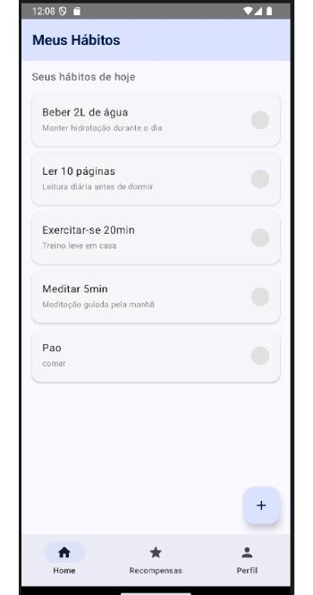
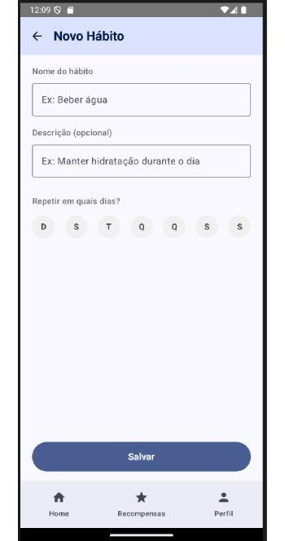
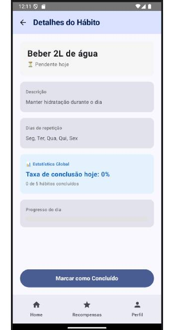
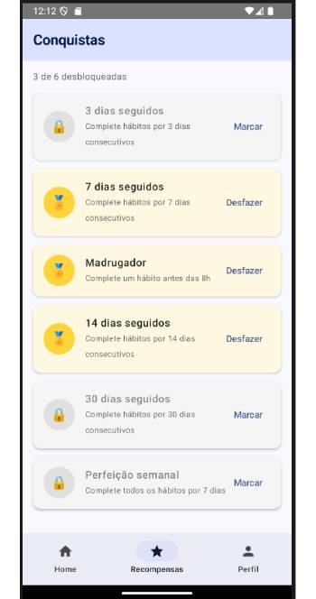
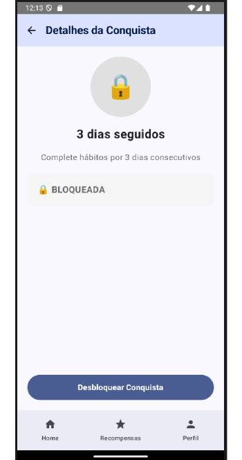
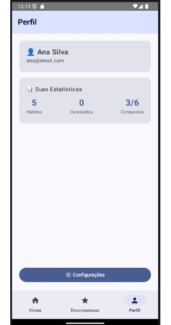
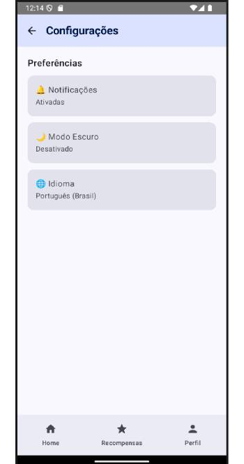

# HabitTracker - Trabalho 2

Aplicativo Android individual de rastreamento de hábitos diários com gamificação, desenvolvido em Kotlin com Jetpack Compose.

## Integrante
- Marcio Henrique

## Funcionalidades Implementadas
- ✅ Lista de hábitos com `LazyColumn` e toggle de conclusão
- ✅ Adicionar novo hábito via formulário (nome, descrição, dias da semana)
- ✅ Lista de conquistas com toggle de desbloqueio
- ✅ Tela de detalhes do hábito com estatísticas calculadas e barra de progresso (complexidade extra)
- ✅ Tela de detalhes da conquista
- ✅ Navegação com BottomBar (3 abas) + NavHost centralizado
- ✅ Botão de voltar funcional (`popBackStack`) em telas secundárias
- ✅ 7 telas navegáveis no total
- ✅ 2 Data Classes (`Habito`, `Conquista`) com estado reativo via `mutableStateListOf`

## Tecnologias Utilizadas
- Kotlin
- Jetpack Compose
- Navigation Compose (`NavHost`, `NavController`, `Rotas`)
- ViewModel + `mutableStateListOf`
- Android Studio

## Como Rodar o Projeto

### Pré-requisitos
- Android Studio Hedgehog (ou superior)
- JDK 17
- Emulador Android (API 24+) ou dispositivo físico com USB debugging ativado

### Passo a Passo
1. Clone o repositório:
   ```bash
   git clone https://github.com/mhenriqueof/aplicativos-moveis-projeto-A2.git
   ```

2. Abra o projeto no Android Studio (`File > Open`).

3. Aguarde o Gradle sincronizar as dependências automaticamente.

4. Selecione um emulador configurado ou conecte um dispositivo físico.

5. Clique em **Run 'app'** (▶️) ou pressione `Shift + F10`.

## Estrutura do Projeto
```
app/src/main/java/com/example/habittracker/
├── data/model/          # Data classes (Habito.kt, Conquista.kt)
├── navigation/          # Rotas.kt, AppNavigation.kt
├── ui/screens/          # Telas Compose (Home, NovoHabito, Recompensas, etc.)
├── ui/viewmodel/        # HabitViewModel.kt (estado compartilhado)
└── MainActivity.kt      # Entry point do app
```

## Screenshots do App

### Home


### Novo Hábito


### Detalhe Hábito


### Recompensas


### Detalhe Recompensas


### Perfil


### Configurações



## Observações
- Os dados vivem apenas em memória (`mutableStateListOf`). Ao fechar o app, as alterações são perdidas.
- Persistência com Room/DataStore será implementada em trabalho futuro.
```